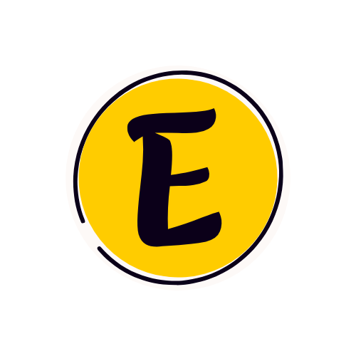
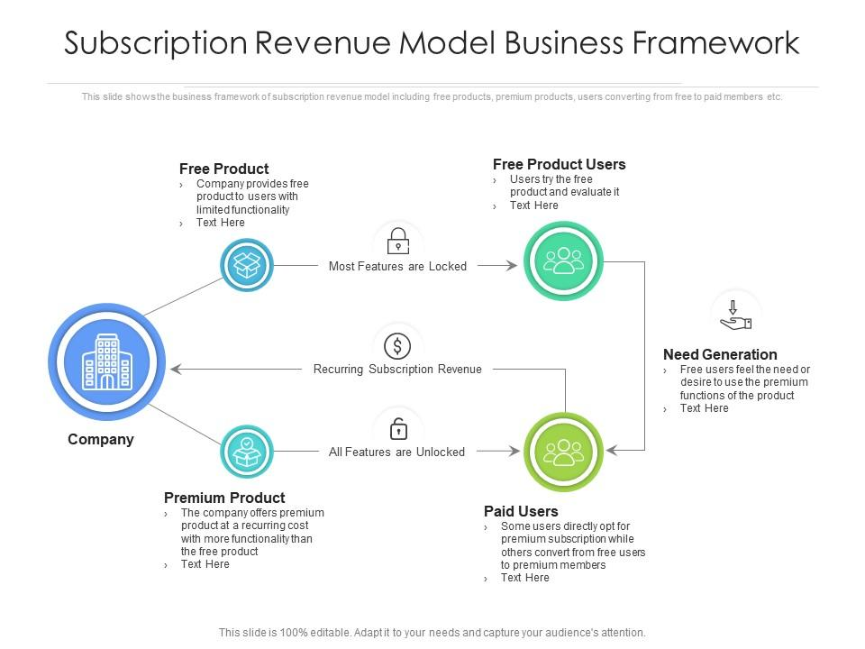

# EzyNFT

## 🤔Problem Statement

- Cryptocurrency and blockchain technology can be daunting for many potential users, as indicated by Kantar’s survey, which found that 29% of Indians are not familiar with cryptocurrencies and 45% find them too complicated to understand.
- Research further reveals that 53% of people feel overwhelmed by the complexities associated with cryptocurrency and blockchain technology
- EzyNFT is developing an AI-driven chatbot deployed on NEAR blockchain that utilizes natural language processing and cutting-edge technologies like OpenAI and ChatGPT along with the guarantee of security and privacy of messages.
- It ensures a user-friendly ecosystem that provides security and privacy through blockchain text storage and makes the users aware of web3 and blockchain, users can mint NFTs or upload data to IPFS storage through a simplified chat interface in a few quick steps.

## ⚽Goal

The goal is to eliminate the barriers that have traditionally hindered crypto's growth and adoption, thereby making it more accessible to a wider range of people, at the same time ensuring privacy and security.

## 🔒Assumption

Users feel comfortable understanding and using a system when it aligns with the flow of human interaction.

## 🔑Hypothesis

The market will be favorable to a product simplifying web3 utility processes such as minting NFTs or storing images on IPFS storage for users through natural language understanding as it enhances user participation, and drives the growth of the crypto market.

## 🔔Inspiration

The team at EzyNFT shares a common enthusiasm for blockchain technology and its transformative potential in the field of finance. Their objective is to streamline the process of engaging with cryptocurrencies, making it accessible to individuals from all walks of life. Additionally, they firmly believe in the power of chatbots and natural language processing to simplify intricate tasks associated with cryptocurrencies.

## 🥽Functioning and Workflow

- EzyNFT is an AI-driven blockchain chatbot deployed on NEAR that simplifies the process of minting NFTs (Non-Fungible Tokens) and storing images on IPFS.
- Initially, the user has to connect to his or her’s NEAR wallet before accessing the chatbot.
- Chats are stored on the NEAR blockchain for future retrieval.
- Through the utilization of Voiceflow and Stable Diffusion APIs, it guides users step-by-step throughout the minting process.
- Users are required to provide necessary details such as name, description, wallet address, and image URL. Alternatively, they can generate an NFT using Stable Diffusion.
- Once all information is provided, EzyNFT proceeds to mint the NFT and provides relevant details such as transaction hash and ID. It also offers URLs for users to view their NFT on block explorers and OpenSea. EzyNFT is compatible with multiple blockchain networks and eliminates the need for users to navigate complex blockchain systems or switch between platforms
- By leveraging AI-driven chatbots and cutting-edge APIs, EzyNFT ensures that minting NFTs becomes easy and accessible for everyone involved.

## 🛠Methodology

- EzyNFT is designed to simplify the interaction with cryptocurrencies and blockchain technology. To achieve this, the platform leverages several advanced technologies such as Voiceflow, Verbwire API, ChatGPT, StableDiffusion API, NEAR Blockchain, and Crypto API.
- Voiceflow enables the creation of user flows and chatbot pathways that facilitate functions like minting NFTs and storing images in IPFS storage. The integration of Verbwire API allows users to generate unique NFT art quickly by using prompts, which are then minted on the blockchain.
- OpenAI's natural language processing capabilities and ChatGPT algorithms enable the chatbot to understand user requests effectively and provide appropriate responses.
- Stable Diffusion API was used as a generative AI tool to generate new images to be minted as NFTs in case user preferred that.
- By combining these cutting-edge technologies, EzyNFT creates a user-friendly platform that makes blockchain technology and cryptocurrencies accessible to individuals without requiring extensive technical knowledge or experience in the field.

## 🎗Integration With NEAR

- We linked the NEAR wallet with the EzyNFT as a sign-in procedure to ensure the existence of the user’s credentials on NEAR’s platform
- NEAR’s Blockchain Operating System (BOS) was used for the development of a decentralized front end.
- Chat interactions are loaded and stored on the NEAR blockchain to ensure future retrieval. It perpetuates the security and privacy of such interaction and keeps the transaction details happening on the chat a secret, thus less susceptible to being stolen or corrupted. We used Voiceflow’s Dialog Manager API to extract individual texts to be stored on the chain.

## 🌨****Challenges****

- Integrating Metamask with Voiceflow was a significant hurdle due to the inability to run asynchronous functions together. However, after reaching out to Voiceflow customer service, they found an alternative solution by incorporating Verbwire.
- Another challenge was developing the NFT minting feature, which involved extensive communication between users and the bot. Despite these obstacles, they successfully created a functional and user-friendly feature.
- Integrating Voiceflow chat with NEAR Blockchain was a significant challenge. We used Voiceflow’s Dialog Manager API to extract individual texts to be stored on the blockchain.
- Deploying the web application online proved to be a challenge since contract scripts were not compiling correctly. We pre-compiled the scripts and removed the smart-contract deploying step during the online deployment of the web application.

## 📈Product and Market

- We chose this particular hack because we believe that the greatest impediment to crypto’s growth lies in the complexity of web3 procedures. NEAR, Voiceflow, and OpenAI help us to alleviate such concerns and simplify the process of minting and storage(IPFS).
- We believe that a chat tool that can perform such tasks on the user’s behalf, abstracting the complex procedure, will lead to a growth of user participation in the web3 ecosystem.
- The market of this product encompasses all those individuals who looking to invest in crypto but are intimidated by its complexity or lack understanding of its underlying concepts.

## 🤑Business Model

We plan to use a Fee-For-Service model, which is also called Paid Subscription Model. We will be providing premium features to the users who subscribe to our services. This kind of model is also used by Google, Spotify and many more successful companies, thus it is reliable and scalable.

Basic Features:

- Limited numbers of chains to mint on
- Limit on image size on IPFS storage
- A limited number of requests to mint or performing storage tasks

Premium Features:

- Access to the majority of chains in the web3 ecosystem
- Cross-chain NFT transfer functionality
- Bulk image import for IPFS storage
- Unlimited querying with the chatbot

## 🤨Why EzyNFT?

At this moment with the growing crypto industry, and the fast-paced development of the Web3 ecosystem, we believe it is absolutely essential to simplify the process of important transactions in order to support higher user engagement and participation. 

*A balance needs to be struck between the public perception and understanding of Web3 and the actual processes and trades in the crypto market!*

An AI-powered chatbot that can perform these highly convoluted trading tasks with a few, quick natural language sentences, can help bring in more users and more money.

## ✨Project Outcome and Learning

- The team gained a comprehensive understanding of blockchain technology(especially NEAR) and became proficient in utilizing various blockchain services.
- They also acquired valuable skills in natural language processing and AI technology, specifically through integrating OpenAI ChatGPT and Stable Diffusion into their platform.
- Furthermore, the project allowed them to develop essential soft skills such as effective communication, collaboration, and project management.
- Working on EzyNFT taught the team how to manage time efficiently and operate under tight deadlines.
- Additionally, they recognized the significance of education and outreach efforts when it comes to cryptocurrencies and blockchain technology.
- This experience highlighted the importance of spreading knowledge about these topics among wider audiences.

## 👣Long Term Plan

We plan to build a full-fledged chatbot completely embedded into the NEAR blockchain ecosystem with some intricate functionalities involving NEAR blockchain:

1. [1-3 weeks]: Adding the option of minting on NEAR blockchain. (Not present in the existing prototype)
2. [3-6 weeks]: Supporting cross-chain NFT transfer with the chatbot.
3. [6-9 weeks]: Building a payment/subscription service for our business model.
4. [9-12 weeks]: Developing and embedding the entire front-end on NEAR, and removing Voiceflow’s UI/UX renderer.

We will be using our 20,000 NEAR Horizon Credits to create a liquidity pool😅😅and would like to integrate it into the ecosystem as an automated market maker(AMM). The marking will be against Ethereum - ETH/NEAR Liquidity Pool.
